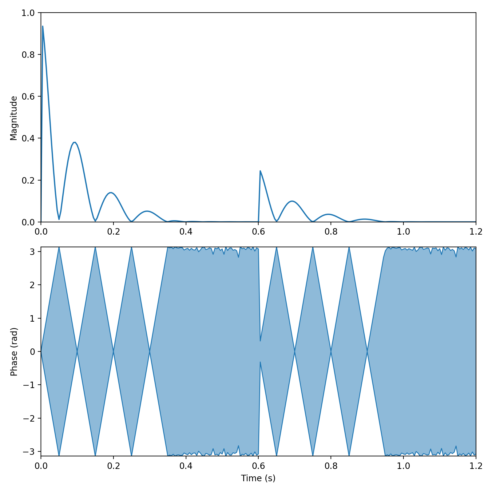

Bloch simulation
================

The Bloch simulation in Sycomore is based on Hargreaves's 2001 paper `Characterization and Reduction of the Transient Response in Steady-State MR Imaging`_ where limiting cases of the full spin behavior (instantaneous RF pulse, "pure" relaxation, "pure" precession, etc.) are expressed as matrices. The matrices representing building blocks of a sequence are multiplied amongst them, forming a single matrix operator for a repetition. Iterating this process yields a fast simulation of the evolution of a single isochromat and the eigenanalysis of the resulting matrix yields important insights on the steady-state of the sequence.

Homogeneous coordinates
-----------------------

An `homogeneous form`_ of all matrices and vectors is used to obtain a purely multiplicative form of the matrix operators. Using homogenous coordinates (also called projective coordinates), a vector in :math:`\mathbb{R}^3` with Cartesian coordinates :math:`(x_c, y_c, z_c)` is represented as a *set* of 4D vectors in :math:`\mathbb{PR}^3`, the three dimension projective space, :math:`(x_p, y_p, z_p, w)` so that :math:`(x_c, y_c, z_c) = (x_p/w, y_p/w, z_p/w)`. In this representation, any geometric transformation which can be expressed as a 3×3 matrix :math:`M` can also be represented as a 4×4 homogeneous matrix:

.. math::
  
  \begin{bmatrix}
    M & \begin{matrix} 0 \\ 0 \\ 0 \end{matrix} \\
    \begin{matrix} 0 & 0 & 0 \end{matrix} & 1
  \end{bmatrix}

Moreover, a translation :math:`\mathbf{T} = (T_x, T_y, T_z)` can also be represented as a 4×4 homogeneous matrix:

.. math::
  
  \begin{bmatrix}
    1 & 0 & 0 & T_x \\
    0 & 1 & 0 & T_y \\
    0 & 0 & 1 & T_z \\
    0 & 0 & 0 & 1
  \end{bmatrix}

The composition of the geometric transforms described by those homogeneous matrices is given by multiplying the matrices, as is the case in Euclidean coordinates.

Usage
-----

The basic operators of Bloch simulation are :func:`sycomore.bloch.pulse` and :func:`sycomore.bloch.time_interval`. They both use the :class:`sycomore.Species` class and the :ref:`units<units>` system.

Contrary to :doc:`Extended Phase Graphs (EPG)<epg/index>` which simulate at voxel-level, Bloch simulation works on a single isochromat. It is however possible to explicitely use Bloch simulation for a whole voxel. The following example shows the simulation of a RARE sequence with 50 different positions in a voxel: the fanning-out and fanning-in of phases is clearly visible on both the phase and the magnitude plots.

.. code-block:: python
  
  import numpy
  import sycomore
  from sycomore.units import *

  species = sycomore.Species(1000*ms, 100*ms)
  m0 = [0., 0., 1., 1.]

  TR = 600*ms
  TE = 100*ms

  time_step = 5*ms
  train_length = 3
  repetitions = 2

  voxel_size = 1*mm
  positions_count = 50

  steps = 1+int((repetitions*TR/time_step).magnitude)
  times = [x.convert_to(s) for x in sycomore.linspace(0*s, repetitions*TR, steps)]

  excitation = sycomore.bloch.pulse(90*deg, 90*deg)
  refocalization = sycomore.bloch.pulse(180*deg, 0*rad)

  positions = sycomore.linspace(voxel_size, positions_count)
  gradient = 1/sycomore.gamma / voxel_size / (TE/2)

  time_intervals = numpy.asarray([
      sycomore.bloch.time_interval(
          species, time_step, gradient_amplitude=gradient, position=position)
      for position in positions])

  magnetizations = numpy.full((positions_count, steps, 4), m0)
  for step, t in enumerate(times[:-1]):
      if numpy.allclose(t % TR.convert_to(s), 0) and step != len(times)-1:
          pulse = excitation
      elif numpy.allclose(t % TE.convert_to(s), TE.convert_to(s)/2):
          # Time from start of TR
          t_TR = (t%TR.convert_to(s))
          echo = numpy.round((t_TR-TE.convert_to(s)/2)/TE.convert_to(s))
          if echo < train_length:
              pulse = refocalization
          else:
              pulse = numpy.identity(4)
      else:
          # print(t, "nothing")
          pulse = numpy.identity(4)
      magnetizations[:,step+1] = numpy.einsum(
          "ij,oj->oi", pulse, magnetizations[:,step])
      magnetizations[:,step+1] = numpy.einsum(
          "oij,oj->oi", time_intervals, magnetizations[:,step+1])

  signals = [m[:,0]+1j*m[:,1] for m in magnetizations]
  phases = numpy.angle(signals)

  
  Bloch simulation of a Fast Spin Echo sequence

Reference
---------

.. function:: sycomore.bloch.pulse(angle, phase=0*rad)
  
  Instantaneous RF pulse with specified angle and phase.

.. function:: sycomore.bloch.time_interval(species, duration)
  
  Composition of relaxation and phase accumulation.

.. function:: sycomore.bloch.relaxation(species, duration)
  
  "Pure" relaxation process.

.. function:: sycomore.bloch.phase_accumulation(angle)
  
  "Pure" precession.

.. _Characterization and Reduction of the Transient Response in Steady-State MR Imaging: https://doi.org/10.1002/mrm.1170
.. _homogeneous form: https://en.wikipedia.org/wiki/Homogeneous_coordinates
