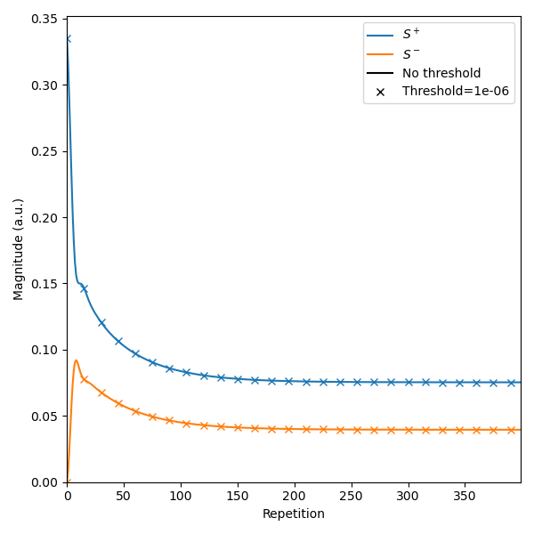

Discrete (arbitrary gradient moment) EPG
========================================

In the *discrete* EPG model (:cpp:class:`C++ <sycomore::epg::Discrete>`, :class:`Python <sycomore.epg.Discrete>`), the gradient moments may vary across time intervals. In this model, the orders of the model are stored in bins of user-specified width (hence the term "discrete"), expressed in rad/m. The interface is otherwise similar to that of :doc:`regular EPG<regular>`.

The following code sample show the full simulation of the DW-DESS_ sequence, with its two read-out modules and its diffusion module. Since the read-out gradient moment is largely smaller than the diffusion gradient moment, its simulation using regular EPG would require to subdivide every time interval to a common duration: with the parameters of the following simulation, even if we neglect the pre-phasing, each repetition would generate over 20 new states with regular EPG, while at most 12 will be generated with discrete EPG.

The discrete EPG model, as well as other models, includes a ``threshold`` member (:cpp:member:`C++ <sycomore::epg::Base::threshold>`, :attr:`Python <sycomore.epg.Base.threshold>`) which controls how states with a low population are discarded. This yields better peformance, at the expanse of a slight loss in precision. As an example, using a threshold of :math:`10^{-6}` in the DESS simulation reduces the computation time from 23 ms to 15 ms (i.e. by a factor 1.5) while conserving a good precision, as shown in the figure below.

.. tab:: Python
  
  .. literalinclude:: ../../examples/epg/discrete.py
    :lines: 2-6, 9-68

.. tab:: C++
  
  .. literalinclude:: ../../examples/epg/discrete.cpp
    :language: cpp

.. note:: The default bin width of :math:`\delta_k=1\ \mathrm{rad/m}` corresponds to a gradient area of :math:`\delta_k/\gamma \approx 3\ \mathrm{\mu T/m\, ms}`. The dephasing orders are stored as 64-bits, signed integers; the default bin width hence allows to handle dephasing orders in the range :math:`\left[-9\cdot 10^{18}\ \mathrm{rad/m}, +9\cdot 10^{18}\ \mathrm{rad/m} \right]`, i.e. :math:`\left[-3\cdot 10^{16}\ \mathrm{mT/m\, ms}, +3\cdot 10^{16}\ \mathrm{mT/m\, ms} \right]`

  
  Simulation of DW-DESS with discrete EPG, without threshold (plain lines) and with threshold (dots)

.. _DW-DESS: https://doi.org/10.1002/mrm.23275
