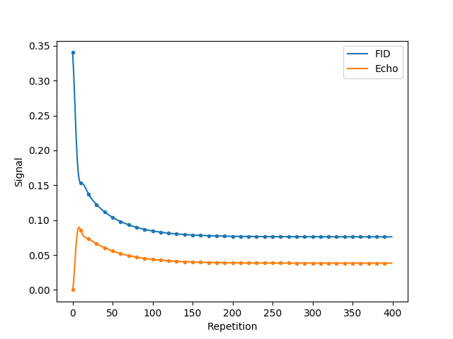

Discrete (arbitrary gradient moment) EPG
========================================

In the *discrete* EPG model, the gradient moments may vary across time intervals. In this model, the orders of the model are stored in bins of user-specified width (hence the term "discrete"), expressed in rad/m. The interface is similar to that of :doc:`regular EPG<regular>`.

The following code sample show the full simulation of the DW-DESS_ sequence, with its two read-out modules and its diffusion module. Since the read-out gradient moment is largely smaller than the diffusion gradient moment, its simulation using regular EPG would require to subdivide every time interval to a common duration: with the parameters of the following simulation, even if we neglect the pre-phasing, each repetition would generate over 20 new states with regular EPG, while at most 12 will be generated with discrete EPG.

.. code-block:: python
    
    import numpy
    import sycomore
    from sycomore.units import *
    
    species = sycomore.Species(1000*ms, 100*ms, 1*um**2/ms)
    flip_angle=20*deg
    # Timings
    prephasing = 1*us
    TE = 1*ms
    TR = 10*ms
    tau = TR - 2*TE - 2*prephasing # Duration of diffusion gradient
    # Gradients
    slice_thickness = 1*mm
    G_readout = 2*numpy.pi*rad / (sycomore.gamma*slice_thickness)
    G_diffusion = 200*mT/m*ms
    
    model = sycomore.epg.Discrete(species)
    repetitions = int((4*species.T1/TR).magnitude)
    
    FID = numpy.zeros(repetitions, dtype=complex)
    echo = numpy.zeros(repetitions, dtype=complex)
    for repetition in range(repetitions):
        model.apply_pulse(flip_angle)
        
        model.apply_time_interval(prephasing, -G_readout/2/prephasing)
        model.apply_time_interval(TE/2, G_readout/2/(TE/2))
        FID[repetition] = model.echo
        model.apply_time_interval(TE/2, G_readout/2/(TE/2))
        
        model.apply_time_interval(tau, G_diffusion/tau)
        
        model.apply_time_interval(TE/2, G_readout/2/(TE/2))
        echo[repetition] = model.echo
        model.apply_time_interval(TE/2, G_readout/2/(TE/2))
        model.apply_time_interval(prephasing, -G_readout/2/prephasing)
      
.. note:: The default bin width of :math:`\delta_k=1\ \mathrm{rad/m}` corresponds to a gradient area of :math:`\delta_k/\gamma \approx 3\ \mathrm{\mu T/m\, ms}`. The dephasing orders are stored as 64-bits, signed integers; the default bin width hence allows to handle dephasing orders in the range :math:`\left[-9\cdot 10^{18}\ \mathrm{rad/m}, +9\cdot 10^{18}\ \mathrm{rad/m} \right]`, i.e. :math:`\left[-3\cdot 10^{16}\ \mathrm{mT/m\, ms}, +3\cdot 10^{16}\ \mathrm{mT/m\, ms} \right]`

The previous code will generate a large number of states, which will translate to a long execution time. Better performance can be gained by discarding the states with a low population, at the expense of a slight losss in precision: this is achieved by passing a non-zero value to the *threshold* parameter of the :meth:`Discrete.apply_time_interval` function. As an example, using a threshold of :math:`10^{-4}` in the previous simulation drastically reduces the computation time from 5 minutes to 50 ms while conserving a good precision, as shown in the following figure.

  
  Simulation of DW-DESS with discrete EPG, without threshold (plain lines) and with threshold (dots)

Reference
---------

.. class:: sycomore.epg.Discrete(species, initial_magnetization=Magnetization(0,0,1), bin_width=1*rad/m)
  
  .. attribute:: species
    
    The species being simulated
  
  .. attribute:: orders
    
    The sequence of orders currently stored by the model, in the same order as
    the :attr:`states` member. This attribute is read-only.
  
  .. attribute:: states
    
    The sequence of states currently stored by the model, in the same order as
    the :attr:`orders` member. This attribute is a read-only, 3×N array of complex numbers.
  
  .. attribute:: echo
    
    The echo signal, i.e. :math:`\tilde{F}_0` (read-only).
  
  .. method:: state(index)
    
    Return the magnetization at a given state, expressed by its *index*.
  
  .. method:: state(order)
    
    Return the magnetization at a given state, expressed by its *order*.

  .. method:: apply_pulse(angle, phase=0*rad)
    
    Apply an RF hard pulse.
  
  .. method:: apply_time_interval(duration, gradient=0*T/m, threshold=0.)
    
    Apply a time interval, i.e. relaxation, diffusion, and gradient. States with a population lower than *threshold* will be removed.
  
  .. method:: shift(duration, gradient)
    
    Apply a gradient; in discrete EPG, this shifts all orders by specified value.
  
  .. method:: relaxation(duration, gradient)
    
    Simulate the relaxation during given duration.
  
  .. method:: diffusion(duration, gradient)
    
    Simulate diffusion during given duration with given gradient amplitude.

.. _DW-DESS: https://doi.org/10.1002/mrm.23275
