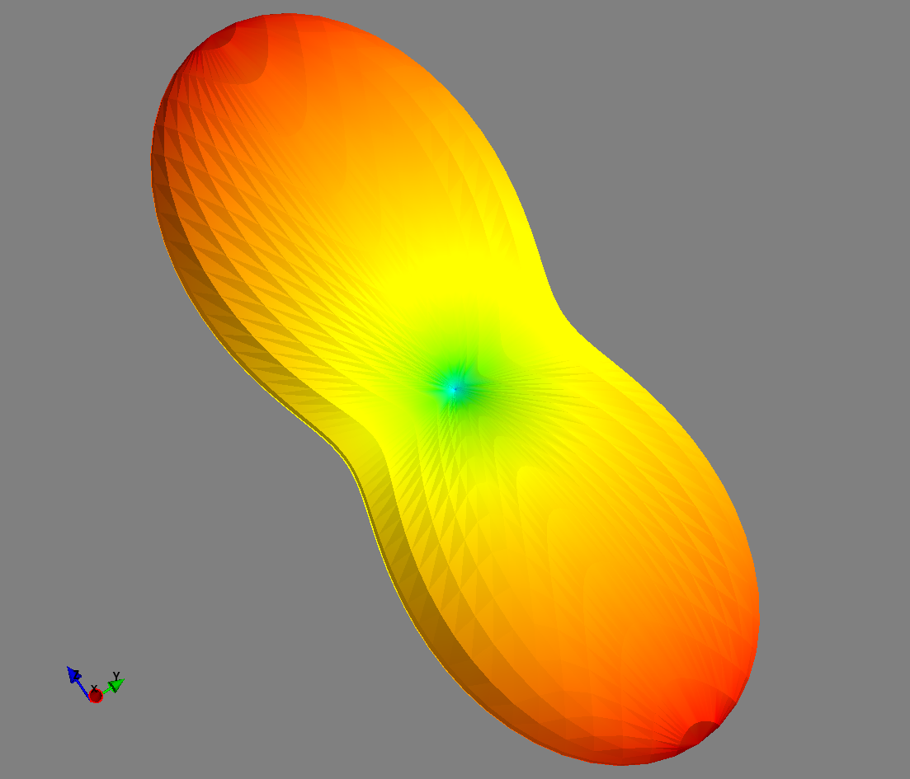

Discrete (arbitrary gradient moment) EPG in 3D
==============================================

In the 3D discrete EPG model, the gradient moments may vary across time intervals as in :doc:`regular EPG<regular>`, but their amplitude is specified on the three spatial axes.

The following code sample simulates a PGSE diffusion sequence in an anisotropic medium and shows the dependency of the signal attenuation to the relative orientation of diffusion tensor and of the diffusion gradient.

.. code-block:: python
    
  import mayavi.mlab
  import numpy
  import sycomore
  from sycomore.units import *
  from tvtk.api import tvtk

  # Values from "Diffusion tensor MR imaging of the human brain", 
  # Pierpaoli et al., Radiology 201(3), 1996
  D = (numpy.diag([1708, 303, 114])*um**2/s).ravel()

  # Given the echo time, the maximum gradient amplitude and the requested b-value,
  # compute the value of δ, the duration of the gradient pulse.
  # Since b = (γGδ)^2 ⋅ (Δ-δ/3) and Δ = TE-δ, we can eliminate Δ:
  #   b = (γGδ)^2 ⋅ (TE-δ-δ/3) = (γGδ)^2 ⋅ (TE-4/3⋅δ)
  #   ⇔ -4/3⋅δ^3 + TE⋅δ^2 - b/(γG)^2 = 0
  b = 1000*s/mm**2
  G = 45*mT/m
  TE = 50*ms
  roots = numpy.polynomial.Polynomial(
          [(-b/(sycomore.gamma*G)**2).magnitude, 0, TE.magnitude, -4./3.]
      ).roots()
  # Keep only real, positive roots which are less than TE/2 (i.e. before the
  # refocussing pulse).
  delta = [
      x for x in roots 
      if numpy.imag(x) == 0 and (0 < numpy.real(x) < (TE/2).magnitude)]
  if not delta:
      raise Exception("b value cannot be obtained")
  delta = delta[0]*s
  print("δ={} ms".format(delta.convert_to(ms)))

  def pgse(species, TE, b, G, delta, trace=False):
      model = sycomore.epg.Discrete3D(species)
      
      # Excitation
      model.apply_pulse(90*deg)
      
      # Diffusion-sensitization gradient and mixing time
      model.apply_time_interval(delta, G)
      model.apply_time_interval(TE/2-delta)
      
      # Refocussing
      model.apply_pulse(180*deg)
      
      # Mixing time and diffusion-sensitization gradient
      model.apply_time_interval(TE/2-delta)
      model.apply_time_interval(delta, G)
      
      return numpy.abs(model.echo)

  # Generate a unit sphere
  sphere_source = tvtk.SphereSource(
      center=[0,0,0], radius=1, theta_resolution=50, phi_resolution=50)
  sphere_source.update()
  sphere = sphere_source.output
  print(len(sphere.points), "points on sphere")

  # Simulate the sequence with a diffusion gradient along each point on the
  # sphere
  species = sycomore.Species(1000*ms, 100*ms, D)
  S_0 = pgse(species, TE, b, [0*mT/m, 0*mT/m, 0*mT/m], delta)
  attenuation = numpy.zeros((len(sphere.points))) 
  for index, point in enumerate(sphere.points):
      S = pgse(species, TE, b, [x*G for x in point], delta)
      attenuation[index] = S/S_0
      if attenuation[index] != 0:
          # Exagerate attenuation for visualisation purposes
          sphere.points[index] = [x*attenuation[index]**6 for x in point]
  sphere.point_data.scalars = attenuation

  # Recompute the normals of the surface and plot the result
  normals = mayavi.tools.pipeline.poly_data_normals(sphere)
  surface = mayavi.mlab.pipeline.surface(normals)
  surface.module_manager.scalar_lut_manager.use_default_range = False
  surface.module_manager.scalar_lut_manager.data_range = [
      attenuation.min(), attenuation.max()]
  mayavi.mlab.show()

  
  Simulation of signal attenuation due to anisotropic diffusion with discrete 3D EPG

Reference
---------

.. class:: sycomore.epg.Discrete3D(species, initial_magnetization=Magnetization(0,0,1), bin_width=1*rad/m)
  
  .. attribute:: species
    
    The species being simulated
  
  .. attribute:: orders
    
    The sequence of orders currently stored by the model, in the same order as
    the :attr:`states` member. This attribute is read-only, 3×N array of dephasing (in rad/m).
  
  .. attribute:: states
    
    The sequence of states currently stored by the model, in the same order as
    the :attr:`orders` member. This attribute is a read-only, 3×N array of complex numbers.
  
  .. attribute:: echo
    
    The echo signal, i.e. :math:`\tilde{F}_0` (read-only).
  
  .. method:: state(index)
    
    Return the magnetization at a given state, expressed by its *index*.
  
  .. method:: state(order)
    
    Return the magnetization at a given state, expressed by its *order*.

  .. method:: apply_pulse(angle, phase=0*rad)
    
    Apply an RF hard pulse.
  
  .. method:: apply_time_interval(duration, gradient=[0*T/m, 0*T/m, 0*T/m],  threshold=0.)
    
    Apply a time interval, i.e. relaxation, diffusion, and gradient. States with a population lower than *threshold* will be removed.
  
  .. method:: shift(duration, gradient)
    
    Apply a gradient; in discrete EPG, this shifts all orders by specified value.
  
  .. method:: relaxation(duration, gradient)
    
    Simulate the relaxation during given duration.
  
  .. method:: diffusion(duration, gradient)
    
    Simulate diffusion during given duration with given gradient amplitude.
