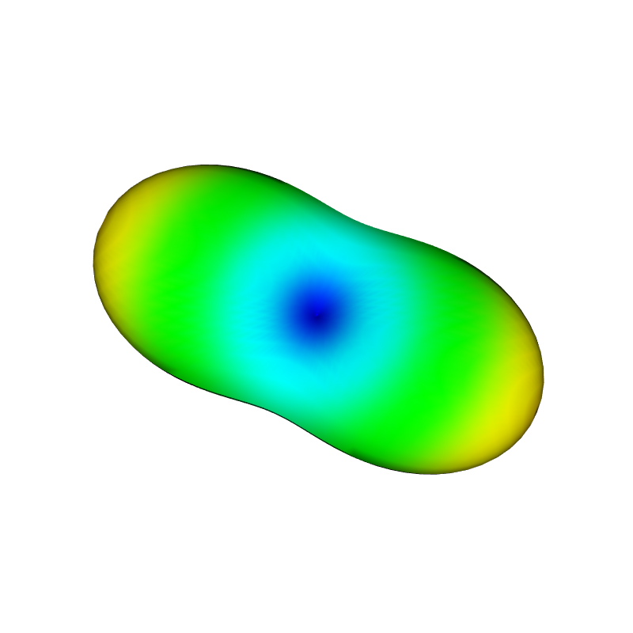

Discrete (arbitrary gradient moment) EPG in 3D
==============================================

In the 3D discrete EPG model (:cpp:class:`C++ <sycomore::epg::Discrete3D>`, :class:`Python <sycomore.epg.Discrete3D>`), the gradient moments may vary across time intervals as in :doc:`regular EPG<regular>`, but their amplitude is specified on the three spatial axes. The class interface is similar to the two other models.

The following code sample simulates a idealized PGSE diffusion sequence in an anisotropic medium and shows the dependency of the signal attenuation to the relative orientation of diffusion tensor and of the diffusion gradient.

.. literalinclude:: discrete_3d.py
    :lines: 3-7, 10-56

By using VTK for the sphere source, we can easily generate a screenshot of the attenuation profile in 3D

.. literalinclude:: discrete_3d.py
    :lines: 1-2, 9-10, 57-

  
  Simulation of signal attenuation due to anisotropic diffusion with discrete 3D EPG
