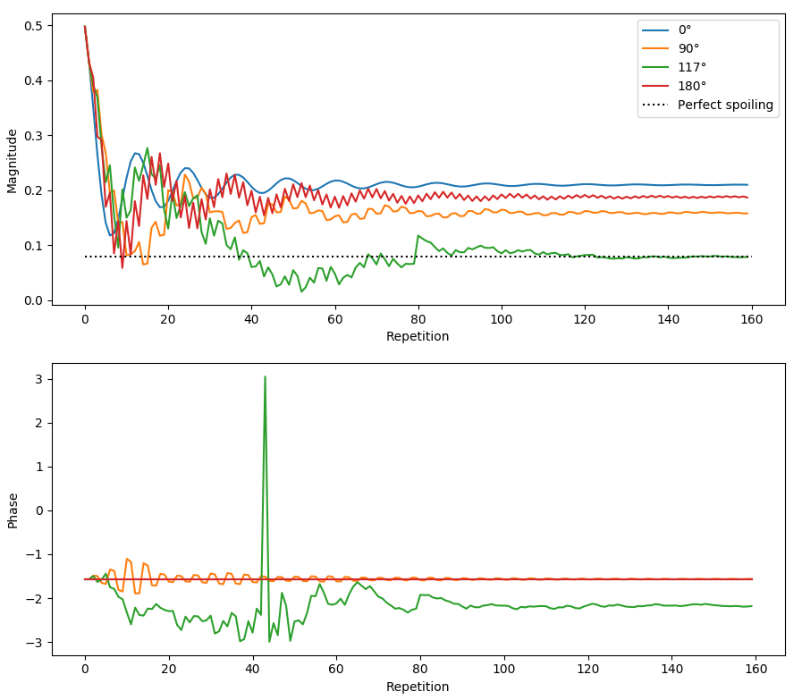

Regular (constant gradient moment) EPG
======================================

In the regular EPG model, the dephasing order is reduced to a unitless integer :math:`k\ge 0` which represents a multiplicative factor of some arbitrary basic dephasing. The implementation of regular EPG in Sycomore has two high-level operations: :meth:`Regular.apply_pulse` to simulate an RF hard pulse and :meth:`Regular.apply_time_interval` which simulates relaxation, diffusion and dephasing due to gradients. The lower-level EPG operators used by :meth:`Regular.apply_time_interval` are also accessible as :meth:`Regular.relaxation`, :meth:`Regular.diffusion` and :meth:`Regular.shift`. The states of the model are stored in :attr:`Regular.states`, and the fully-focused magnetization (i.e. :math:`\tilde{F}_0`) is stored in :attr:`Regular.echo`.

The following code sample simulates the evolution of the signal in an `RF- & gradient spoiled GRE`_ experiment.

.. code-block:: python
    
    import numpy
    import sycomore
    from sycomore.units import *
    
    species = sycomore.Species(1000*ms, 1000*ms)
    flip_angle=30*deg
    TE = 5*ms
    TR = 25*ms
    phase_step = 117*deg
    slice_thickness = 1*mm
    G_readout = 2*numpy.pi*rad / (sycomore.gamma*slice_thickness)
    
    model = sycomore.epg.Regular(species)
    repetitions = int((4*species.T1/TR).magnitude)
    
    echo = numpy.zeros(repetitions, dtype=complex)
    for r in range(0, repetitions):
        phase = (phase_step * 1/2*(r+1)*r)
        
        model.apply_pulse(flip_angle, phase)
        model.apply_time_interval(TE)
        
        rewind = numpy.exp(-1j*phase.convert_to(rad))
        echo[r] = model.echo*rewind
        
        model.apply_time_interval(TR-TE, G_readout/(TR-TE))

Once the echo signal has been gathered for all repetitions, its magnitude and phase can be plotted using respectively `numpy.abs`_ and `numpy.angle`_.

  
  Simulation of RF spoiling with regular EPG, using different phase steps

Reference
---------

.. class:: sycomore.epg.Regular(species, initial_magnetization=Magnetization(0,0,1), initial_size=100)
  
  .. attribute:: species
    
    The species being simulated
  
  .. attribute:: states_count
    
    The number of states currently stored by the model. This attribute is read-only.
  
  .. attribute:: states
    
    The sequence of states currently stored by the model. This attribute is a read-only, 3×N array of complex numbers.
  
  .. attribute:: echo
    
    The echo signal, i.e. :math:`\tilde{F}_0` (read-only).
  
  .. method:: state(index)
    
    Return the magnetization at a given state, expressed by its *index*.
  
  .. method:: apply_pulse(angle, phase=0*rad)
    
    Apply an RF hard pulse.
  
  .. method:: apply_time_interval(duration, gradient=0*T/m)
    
    Apply a time interval, i.e. relaxation, diffusion, and gradient.
  
  .. method:: shift()
    
    Apply a gradient; in regular EPG, this shifts all orders by 1.
  
  .. method:: relaxation(duration, gradient)
    
    Simulate the relaxation during given duration.
  
  .. method:: diffusion(duration, gradient)
    
    Simulate diffusion during given duration with given gradient amplitude.

.. _numpy.abs: https://docs.scipy.org/doc/numpy/reference/generated/numpy.absolute.html
.. _numpy.angle: https://docs.scipy.org/doc/numpy/reference/generated/numpy.angle.html
.. _RF- & gradient spoiled GRE: https://doi.org/10.1002/mrm.1910210210
