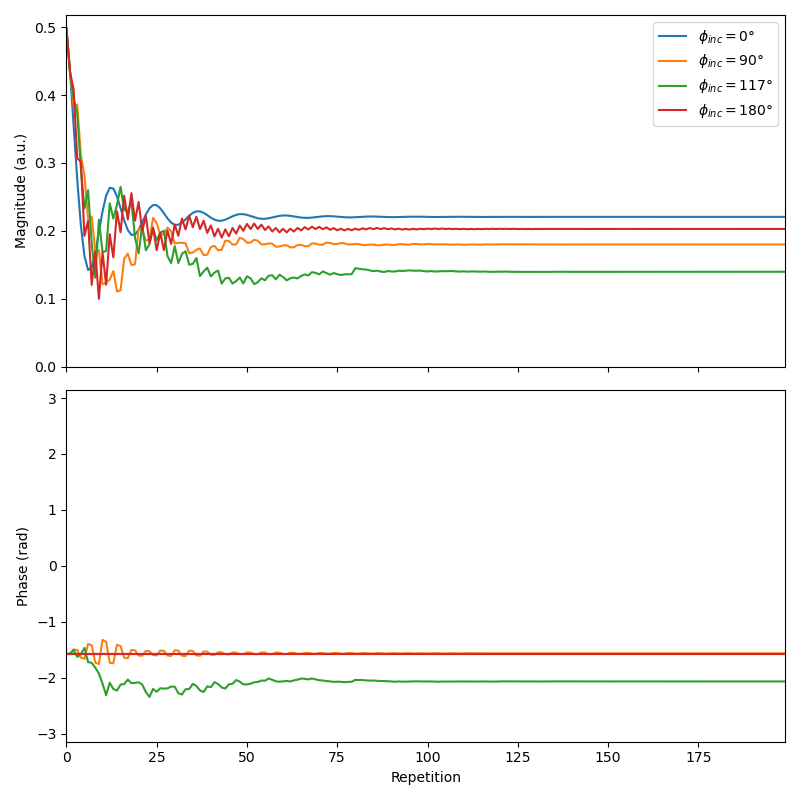

Regular (constant gradient moment) EPG
======================================

In the regular EPG model (:cpp:class:`C++ <sycomore::epg::Regular>`, :class:`Python <sycomore.epg.Regular>`), the dephasing is reduced to a unitless integer :math:`k\ge 0` which represents a multiplicative factor of some arbitrary basic dephasing. The implementation of regular EPG in Sycomore has two high-level operations: ``apply_pulse`` (:cpp:func:`C++ <sycomore::epg::Base::apply_pulse>`, :func:`Python <sycomore.epg.Base.apply_pulse>`) to simulate an RF hard pulse and ``apply_time_interval`` (:cpp:func:`C++ <sycomore::epg::Regular::apply_time_interval>`, :func:`Python <sycomore.epg.Regular.apply_time_interval>`) which simulates relaxation, diffusion and dephasing due to gradients. The lower-level EPG operators used by ``apply_time_interval`` are also accessible as ``relaxation`` (:cpp:func:`C++ <sycomore::epg::Base::relaxation>`, :func:`Python <sycomore.epg.Base.relaxation>`), ``diffusion`` (:cpp:func:`C++ <sycomore::epg::Regular::diffusion>`, :func:`Python <sycomore.epg.Regular.diffusion>`) and ``shift`` (:cpp:func:`C++ <sycomore::epg::Regular::shift>`, :func:`Python <sycomore.epg.Regular.shift>`). The orders and states of the model are stored in respectively in ``orders`` (:cpp:func:`C++ <sycomore::epg::Regular::orders>`, :func:`Python <sycomore.epg.Regular.orders>`) and ``states`` (:cpp:func:`C++ <sycomore::epg::Base::states>`, :func:`Python <sycomore.epg.Base.states>`), and the fully-focused magnetization (i.e. :math:`F_0`) is stored in ``echo`` (:cpp:func:`C++ <sycomore::epg::Base::echo>`, :func:`Python <sycomore.epg.Base.echo>`).

For simulations involving multiple dephasing values (all multiple of a given dephasing), the "unit" dephasing must be declared when creating the model; for simulations involving only a single dephasing value, this declaration is optional, but should be present nevertheless.

The following code sample simulates the evolution of the signal in an `RF-spoiled GRE`_ experiment with different phase increments -- one model is used per phase increment.

.. tab:: Python
  
  .. literalinclude:: ../../examples/epg/regular.py
    :lines: 3-5, 8-46

.. tab:: C++
  
  .. literalinclude:: ../../examples/epg/regular.cpp
    :language: cpp

Once the echo signal has been gathered for all repetitions, its magnitude and phase can be plotted using respectively `numpy.abs`_ and `numpy.angle`_.

.. literalinclude:: ../../examples/epg/regular.py
  :lines: 48-62

  
  Simulation of RF spoiling with regular EPG, using different phase steps

.. _numpy.abs: https://docs.scipy.org/doc/numpy/reference/generated/numpy.absolute.html
.. _numpy.angle: https://docs.scipy.org/doc/numpy/reference/generated/numpy.angle.html
.. _RF-spoiled GRE: https://doi.org/10.1002/mrm.1910210210
