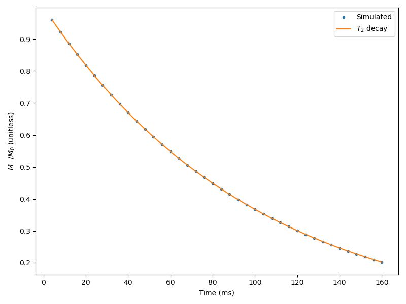

Sycomore -- an MRI simulation toolkit
=====================================

Sycomore is an MRI simulation toolkit providing :doc:`Bloch simulation<bloch>`, :doc:`Extended Phase Graphs (EPG)<epg/index>` (both :doc:`regular<epg/regular>` and :doc:`discrete<epg/discrete>`), and :doc:`Configuration Models<como>`. Sycomore is a Python packge in which all computationnaly-intensive operations are run by a C++ backend, providing a very fast runtime and further acceleration through `OpenMP`_.

Sycomore is free software, released under the `MIT license`_, and its source code is available on `GitHub`_.

A sample web application, using Sycomore paired with `Bokeh`_ is available on `Heroku`_ (note that this is using the free Heroku hosting, and start-up times might be rather long; this does not impact the performance when the application is running): it presents classical MRI experiments (RARE, RF-spoiling, slice profile with a selective sinc pulse), using the different simulation models of Sycomore.

Installation
------------

Packaged versions of Sycomore are available on `pypi`_ and `Anaconda`_ for Linux, macOS and Windows. The following table summarizes the availability of packages according to the version of the Python interpreter.

+------------------+---------------+---------------+
| Operating system | conda-forge   | PyPI          |
+==================+===============+===============+
| Linux            | 3.6, 3.7      | 3.5, 3.6, 3.7 |
+------------------+---------------+---------------+
| macOS (≥ 9)      | 3.6, 3.7      | 3.6, 3.7      |
+------------------+---------------+---------------+
| Windows          | not available | 3.5, 3.6, 3.7 |
+------------------+---------------+---------------+

To install from `Anaconda`_, type ``conda install -c conda-forge sycomore``. To install from `pypi`_, type ``pip3 install sycomore`` (or ``pip install sycomore``). If you are installing from `pypi`_ and no pre-compiled version is available for your platform, pip will try to install from the source archive; in that case you will need a C++11 compiler, `CMake`_ and `pybind11`_ to successfully build Sycomore.

Additional details, including building from source, are provided in the :doc:`documentation<installation>`.

As of November 2019, compatibility with Python 2 is still possible: however due to the `end of life of Python 2`_, ensuring this compatibility is not a goal of Sycomore, and no such package is distributed.
 
Usage
-----

The following code simulates a single repetition of a simple `RARE sequence`_ with :doc:`regular EPG<epg/regular>` and plots the transverse magnetization of each echo.

.. code-block:: python
  
  import matplotlib.pyplot
  import numpy
  import sycomore
  from sycomore.units import *

  species = sycomore.Species(1000*ms, 100*ms, 1*um**2/ms)
  TE = 4*ms
  train_length = 40

  model = sycomore.epg.Regular(species)
  data = numpy.zeros(
      train_length, dtype=[("time", sycomore.Quantity), ("signal", complex)])

  model.apply_pulse(90*deg)
  for echo in range(train_length):
     model.apply_time_interval(TE/2)
     model.apply_pulse(180*deg)
     model.apply_time_interval(TE/2)
     
     data[echo] = (((1+echo)*TE), model.echo)

  times = [x.convert_to(ms) for x in data["time"]]
  magnitude = numpy.abs(data["signal"])
  matplotlib.pyplot.plot(times, magnitude, ".", label="Simulated")
  matplotlib.pyplot.plot(
     times, [numpy.exp(-(x*species.R2).magnitude) for x in data["time"]],
     label="$T_2$ decay")

  matplotlib.pyplot.ylim(0,1)
  matplotlib.pyplot.xlabel("Time (ms)")
  matplotlib.pyplot.ylabel("Magnitude")
  matplotlib.pyplot.legend()

  
  T2 decay in RARE

.. toctree::
   :maxdepth: 2
   :caption: Contents:
   :titlesonly:

   installation.rst
   common_features.rst
   bloch.rst
   epg/index.rst
   como.rst

Indices and tables
==================

* :ref:`genindex`

.. _Anaconda: https://www.anaconda.com/distribution/
.. _Bokeh: https://bokeh.org
.. _Boost.Test: https://www.boost.org/doc/libs/release/libs/test/
.. _CMake: https://cmake.org/
.. _end of life of Python 2: https://www.python.org/dev/peps/pep-0373/
.. _GitHub: https://github.com/lamyj/sycomore/
.. _Heroku: https://sycomore.herokuapp.com/
.. _MIT license: https://en.wikipedia.org/wiki/MIT_License
.. _OpenMP: https://www.openmp.org/
.. _pybind11: http://pybind11.readthedocs.io/
.. _pypi: https://pypi.org/project/sycomore/
.. _RARE sequence: https://doi.org/10.1002/mrm.1910030602
