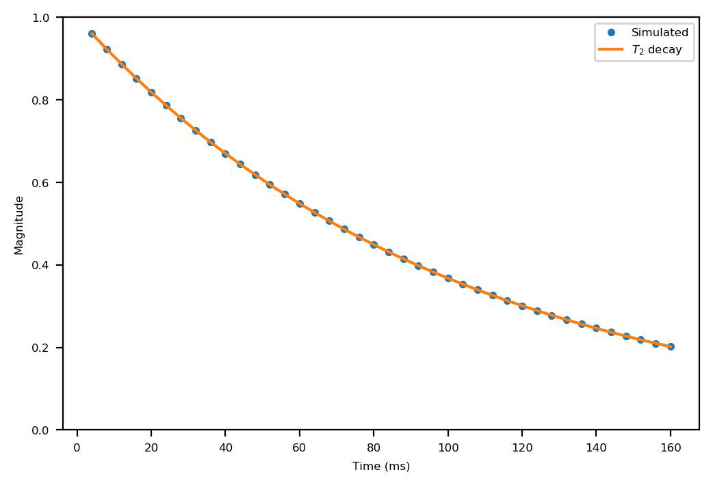

Sycomore -- an MRI simulation toolkit
=====================================

Sycomore is an MRI simulation toolkit providing :doc:`isochromat simulation<isochromat>` and :doc:`Extended Phase Graph (EPG)<epg/index>` (both :doc:`regular<epg/regular>` and :doc:`discrete<epg/discrete>`, including :doc:`3D<epg/discrete_3d>`). Sycomore is a Python package in which all computationally-intensive operations are run by a C++ backend, providing a very fast runtime.

Sycomore is free software, released under the `MIT license`_, and its source code is available on `GitHub`_.

Installation
------------

Packaged versions of Sycomore are available on `pypi`_ and `Anaconda`_ for Linux, macOS and Windows.

To install from `Anaconda`_, type ``conda install -c conda-forge sycomore``. To install from `pypi`_, type ``pip3 install sycomore`` (or ``pip install sycomore``). If you are installing from `pypi`_ and no pre-compiled version is available for your platform, pip will try to install from the source archive; in that case you will need a C++14 compiler, `CMake`_, `xsimd`_, `xtensor`_ and `xtensor-python`_ and `pybind11`_ to successfully build Sycomore.

Additional details, including building from source, are provided in the :doc:`documentation<installation>`.
 
Usage
-----

The following code simulates a single repetition of a simple `RARE sequence`_ with :doc:`regular EPG<epg/regular>` and plots the transverse magnetization of each echo.

.. code:: python

    import matplotlib.pyplot
    import numpy
    import sycomore
    from sycomore.units import *
    
    species = sycomore.Species(1000*ms, 100*ms, 1*um**2/ms)
    TE = 4*ms
    train_length = 40
    
    model = sycomore.epg.Regular(species)
    data = numpy.zeros(
        train_length, dtype=[("time", sycomore.Quantity), ("signal", complex)])
    
    model.apply_pulse(90*deg)
    for echo in range(train_length):
        model.apply_time_interval(TE/2)
        model.apply_pulse(180*deg)
        model.apply_time_interval(TE/2)
        
        data[echo] = (((1+echo)*TE), model.echo)
    
    times = [x.convert_to(ms) for x in data["time"]]
    magnitude = numpy.abs(data["signal"])
    matplotlib.pyplot.plot(times, magnitude, ".", label="Simulated")
    matplotlib.pyplot.plot(
        times, [numpy.exp(-(x*species.R2).magnitude) for x in data["time"]],
        label="$T_2$ decay")
    
    matplotlib.pyplot.ylim(0,1)
    matplotlib.pyplot.xlabel("Time (ms)")
    matplotlib.pyplot.ylabel("Magnitude")
    matplotlib.pyplot.legend()

   T2 decay in RARE

.. toctree::
   :maxdepth: 2
   :caption: Contents:
   :titlesonly:

   installation.rst
   common_features.rst
   isochromat.rst
   epg/index.rst
   api/index.rst

Indices and tables
==================

* :ref:`genindex`

.. _Anaconda: https://anaconda.org/conda-forge/dicomifier
.. _Boost.Test: https://www.boost.org/doc/libs/release/libs/test/
.. _CMake: https://cmake.org/
.. _end of life of Python 2: https://www.python.org/dev/peps/pep-0373/
.. _GitHub: https://github.com/lamyj/sycomore/
.. _MIT license: https://en.wikipedia.org/wiki/MIT_License
.. _pybind11: http://pybind11.readthedocs.io/
.. _pypi: https://pypi.org/project/sycomore/
.. _RARE sequence: https://doi.org/10.1002/mrm.1910030602
.. _xsimd: https://xsimd.readthedocs.io/
.. _xtensor: https://xtensor.readthedocs.io/
.. _xtensor-python: https://xtensor-python.readthedocs.io/
