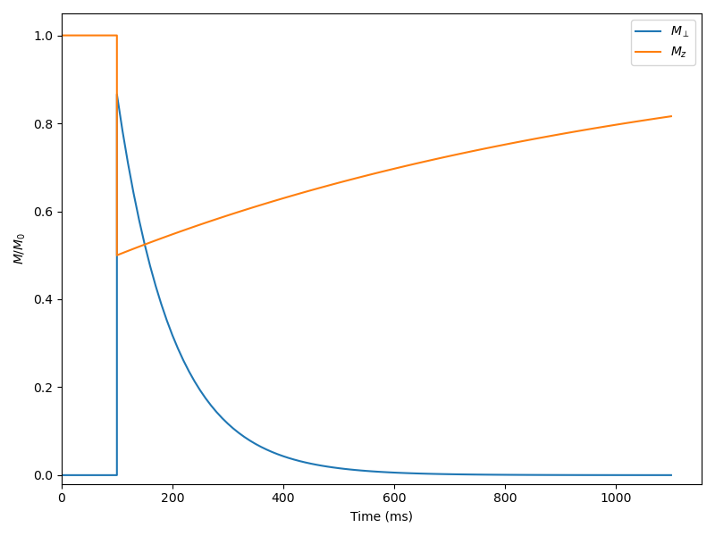

Isochromat Simulations
======================

The isochromat simulation in Sycomore is based on Hargreaves's 2001 paper `Characterization and Reduction of the Transient Response in Steady-State MR Imaging`_ where limiting cases of the full spin behavior (instantaneous RF pulse, "pure" relaxation, "pure" precession, etc.) are expressed as matrices. The matrices representing building blocks of a sequence are multiplied amongst them, forming a single matrix operator for a repetition. Iterating this process yields a fast simulation of the evolution of a single isochromat and the eigenanalysis of the resulting matrix yields important insights on the steady-state of the sequence.

The matrix operators are represented by the `Operator` class (:cpp:class:`C++ <sycomore::isochromat::Operator>`, :class:`Python <sycomore.isochromat.Operator>`). Although they can be hand-written, they are designed to be created and combined by the `Model` class (:cpp:class:`C++ <sycomore::isochromat::Model>`, :class:`Python <sycomore.isochromat.Model>`), which also handles the :math:`T_1` and :math:`T_2` values, and the equilibrium magnetization. All three can be spatially constant or defined at different positions. With a `Model`, operators can be created using the following functions

- `build_pulse` (:cpp:func:`C++ <sycomore::isochromat::Model::build_pulse>`, :func:`Python <sycomore.isochromat.Model.build_pulse>`)
- `build_time_interval` (:cpp:func:`C++ <sycomore::isochromat::Model::build_time_interval>`, :func:`Python <sycomore.isochromat.Model.build_time_interval>`)
- or the individual operators forming `build_time_interval`: `build_relaxation` (:cpp:func:`C++ <sycomore::isochromat::Model::build_relaxation>`, :func:`Python <sycomore.isochromat.Model.build_relaxation>`) and `build_phase_accumulation` (:cpp:func:`C++ <sycomore::isochromat::Model::build_phase_accumulation>`, :func:`Python <sycomore.isochromat.Model.build_phase_accumulation>`)

Two operators can be combined: since Sycomore is using column-vectors, the effect of operator :math:`\mathcal{O}_1` followed by operator :math:`\mathcal{O}_2` on magnetization vector :math:`M` is given by :math:`\mathcal{O}_1 \cdot \mathcal{O}_2 \cdot M`. In a program, operators can be multiplied in-place (`O *= P`), out-of-place (`P = O1 * O2`) or pre-multiplied in-place (`O.pre_multiply(P)`, equivalent to `O = P*O`).

The following code example shows the simulation of a saturation-recuperation experiment: the system is idle for the first 100 ms, a 60° pulse is applied, and the system then relaxes for 1 s. The time step is 10 ms.

.. tab:: Python
  
  .. literalinclude:: ../examples/isochromat.py
    :lines: 3-5,8-31

.. tab:: C++
  
  .. literalinclude:: ../examples/isochromat.cpp
    :language: cpp

  
  Saturation-recuperation using Bloch simulation

.. _Characterization and Reduction of the Transient Response in Steady-State MR Imaging: https://doi.org/10.1002/mrm.1170
